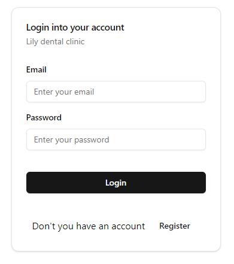
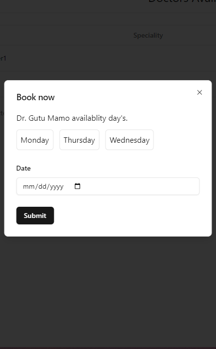
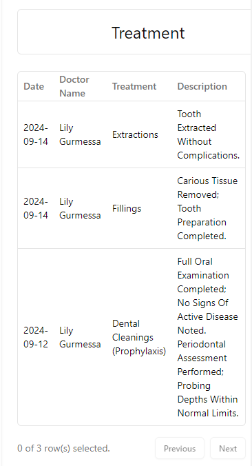

# Dental Clinic Management System

**Effortless Management for Exceptional Dental Clinics.**

## Table of Contents

- [Project Overview](#project-overview)
- [Technologies Used](#technologies-used)
- [Installation](#installation)
- [Usage](#usage)
- [API Documentation](#api-documentation)
- [Project Structure](#project-structure)
- [Screenshots](#Screenshots)
- [Contributing](#contributing)
- [License](#license)

## Project Overview

Dental Clinic Management System is designed to facilitate appointment scheduling, patient record management, and efficient clinic operations. The system is flexible for use by clinics of varying sizes and helps streamline communication between patients, doctors, and staff.

## Technologies Used

- **Frontend**: React(Typescript)
- **Backend**: Django, Django REST Framework
- **Authentication**: JWT (JSON Web Tokens)
- **Database**: PostgreSQL
- **Deployment**: Render

## Installation

1. Clone the repository:
   ```bash
   git clone https://github.com/Naola1/dental_clinic-backend
   cd dentalcare-management
   ```
2. Backend setup:

   - **Create a virtual environment**:

   ```bash
   python3 -m venv venv
   source venv/bin/activate # On Windows: venv\Scripts\activate
   ```

   -**Install backend dependencies**:

   ```bash
   pip install -r requirements.txt
   ```

   - **Set up environment variables in a .env file for JWT_SECRET, database connection, and other configurations.**
   - **Apply migrations:**

   ```bash
   python manage.py migrate
   ```

   - **Start the backend server:**

   ```bash
   python manage.py runserver
   ```

3. Frontend Setup:

   - **Navigate to the frontend folder:**
     ```bash
     cd frontend
     ```
   - **Install dependencies:**
     ```bash
     npm install
     ```
   - **Start the frontend development server:**
     `bash
npm run dev
`
     Your project should now be running locally. You can access the frontend at http://localhost:3000 and the backend API at http://localhost:8000.

## Usage

1. User Registration and Authentication:
   Register patients and doctors through the /api/users/register/ endpoint.
   Use the credentials to log in via /api/users/login/ and receive a JWT token for authenticated API requests.
2. Manage Appointments:
   Patients can book appointments with doctors, and doctors can manage their availability.
   Administrators can search and manage appointments for both patients and doctors.
3. Treatment History and Records:
   Doctors can update patient treatment history through the provided API endpoints.
   Patients can view their treatment history at any time.

## API Endpoints

1. **User Registration and Authentication**

   - **Register**

     ```http
     POST /api/user/register/
     ```

     Registers a new user.

   - **Login**

     ```http
     POST /api/user/login/
     ```

     Authenticates a user and returns a JWT token.

   - **Token Refresh**

     ```http
     POST /api/token/refresh/
     ```

     Refreshes an existing JWT token.

   - **User Profile**

     ```http
     GET /api/user/profile/
     ```

     Retrieves the profile information of the logged-in user.

   - **Change Password**

     ```http
     POST /api/change-password/
     ```

     Allows the logged-in user to change their password.

   - **Password Reset (via Email)**

     ```http
     POST /api/password_reset/
     ```

     Sends a password reset link to the user's email.

   - **Password Reset Confirm**
     ```http
     POST /api/password_reset/confirm/
     ```
     Confirms the password reset with the token sent via email.

2. **Patient Endpoints**

   - **Treatment History**

     ```http
     GET /api/treatment-history/patient/
     ```

     Retrieves the logged-in patient's treatment history.

   - **Appointments**

     ```http
     GET /api/appointments/
     ```

     Retrieves appointments for the logged-in patient.

     ```http
     POST /api/appointments/book/<doctor_id>/
     ```

     Books an appointment with the specified doctor for the logged-in patient.

   - **Doctor Search**
     ```http
     GET /api/doctors/search/?specialty=<specialty>&date=<date>
     ```
     Searches for doctors based on specialty and availability date.

3. **Doctor Endpoints**

   - **Treatment History**

     ```http
     GET /api/treatment-history/doctor/
     ```

     Retrieves treatment histories for patients that the logged-in doctor is treating.

     ```http
     POST /api/treatment-history/doctor/
     ```

     Creates a new treatment history entry for a patient.

     ```http
     GET/PUT/DELETE /api/treatment-history/doctor/<id>/
     ```

     Retrieves, updates, or deletes a treatment history entry for a specific patient.

   - **Availability**

     ```http
     GET /api/availability/
     ```

     Retrieves the availability of the logged-in doctor.

   - **Appointments**

     ```http
     GET /api/appointments/
     ```

     Retrieves all appointments scheduled with the logged-in doctor.

     ```http
     PUT /api/appointments/change-status/<id>/
     ```

     Changes the status of an appointment (e.g., Completed, Cancelled).

     ```http
     GET /api/appointments/search/?query=<search_query>
     ```

     Searches for patient appointments by first name, last name, or phone number.

4. **Receptionist Endpoints**

   - **Appointments**

     ```http
     GET /api/appointments/
     ```

     Retrieves all patient appointments.

     ```http
     GET /api/appointments/search/?query=<search_query>
     ```

     Searches appointments by patient or doctor details (first name, last name, phone number).

5. **General Endpoints**

   - **Doctors**

     ```http
     GET /api/doctors/
     ```

     Retrieves a list of all doctors.

     ```http
     GET /api/doctors/<id>/availability/
     ```

     Retrieves availability for a specific doctor.

## Usage

To test the application:

1. Create a User: Register a patient through /api/users/register/.
2. Login: Use the credentials to log in and receive an authentication token.
3. Access User Profile: Use the token to access the user's profile and manage treatments.

## Project Structure

```bash
├── backend/
│ ├── appointments/ # Appointment scheduling, doctor availability
│ ├── users/ # User profiles, including patients and doctors
│ ├── treatments/ # Treatment types and treatment history management
│ └── manage.py # Django management script
├── frontend/ # React TypeScript frontend
│ ├── src/
│ ├── public/
│ └── vite.config.ts
└── README.md # Project documentation
```

## Screenshots





## Contributing

Contributions are welcome! To contribute:

Fork the repository.
Create a new feature branch.
Commit your changes.
Submit a pull request.

[Visit the DentalCare Management System](https://dental-clinic-frontend-chi.vercel.app/login)
[Linkedin](https://www.linkedin.com/in/naolmitiku)
[Blog](https://medium.com/@naolmitiku/dental-clinic-management-system-8c98cf3ca3ab)

## Licence

MIT License

This project is licensed under the MIT License - see the [LICENSE](./LICENSE) file for details.
